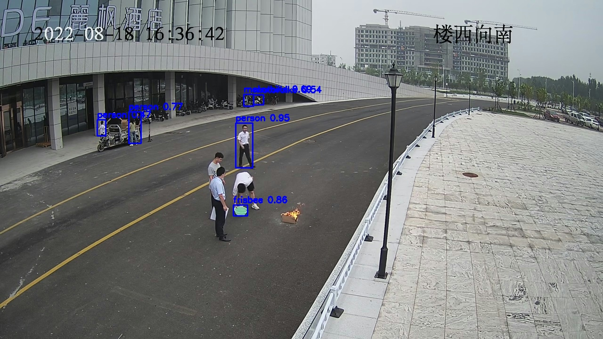
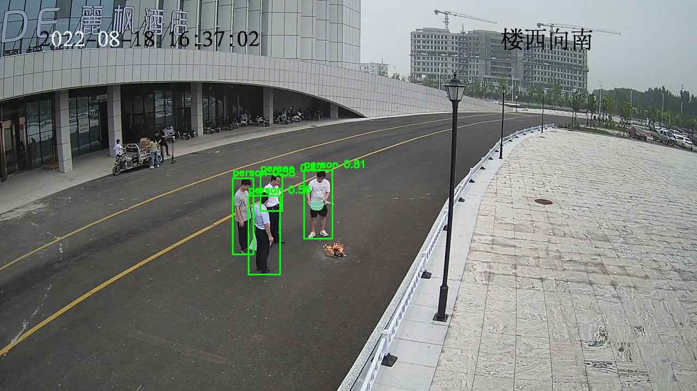
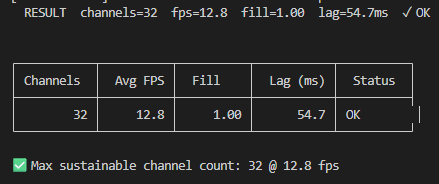
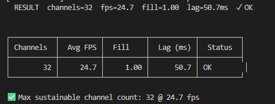

# Multi-Model Multi-Channel Inference on Ascend 910B

Real-time object detection across multiple video streams on the Huawei Ascend 910B NPU, supporting both **YOLOv3** and **YOLOv11**, using MxBase, FFmpeg, and OpenCV.

---

## Overview

A single binary, `infer`, handles all runtime modes. The active model, all file paths, and hardware parameters are selected at runtime via `config.json`. No recompilation is needed to switch between YOLOv3 and YOLOv11.

| Mode | Invocation | Purpose |
|------|-----------|---------|
| `--video` | `./infer --video <file.mp4> <channels>` | Inference on a video file |
| `--rtsp` | `./infer --rtsp <rtsp_url> <channels>` | Inference on live RTSP stream(s) |
| `--sweep` | `./infer --sweep --video\|--rtsp <src> <start> <end> <step>` | Channel sweep to find NPU saturation point |

---

## Project Structure

```
.
├── CMakeLists.txt              # Root build file — defines the infer binary
├── build.sh                    # Convenience script: sources set_env.sh, runs cmake + make
├── make_video.sh               # Assemble saved frames into MP4 using ffmpeg
├── config.json                 # Runtime config — model paths, thresholds, tracker params, batch
├── src/
│   └── main.cpp                # Entry point — CLI parsing and the three run modes
├── detection_utils/
│   ├── detection_utils.h       # Shared pipeline API (ModelConfig, RunPipeline, cfg:: namespace)
│   ├── detection_utils.cpp     # Full pipeline implementation
│   └── CMakeLists.txt          # Builds detection_utils as a STATIC library
├── tracker/
│   └── SimpleTracker.h         # Header-only greedy IoU multi-object tracker
├── yolov3/
│   ├── Yolov3PostProcessNew.h
│   ├── Yolov3PostProcessNew.cpp  # Anchor decode → sigmoid → NMS → blue bounding boxes
│   └── CMakeLists.txt            # Builds yolov3postprocessnew as a SHARED plugin
├── yolov11/
│   ├── Yolov11PostProcess.h
│   ├── Yolov11PostProcess.cpp    # Single-tensor decode → sigmoid → NMS → green bounding boxes
│   └── CMakeLists.txt            # Builds yolov11postprocess as a SHARED plugin
├── model/                      # Compiled .om models and their config files (not in repo)
│   ├── yolov3_tf_bs1_fp16.om
│   ├── yolov3_tf_bs1_fp16.cfg
│   ├── yolov3.names
│   ├── yolov11_bs1_fp16.om
│   ├── yolov11_bs1_fp16.cfg
│   └── yolov11.names
├── data/                       # Test video clips
└── docs/                       # Images referenced by this README
```

### Build targets

| Target | Type | Source directory | Role |
|--------|------|-----------------|------|
| `infer` | executable | `src/` | Main binary — all three run modes |
| `detection_utils` | STATIC lib | `detection_utils/` | Pipeline glue: workers, FFmpeg reader, resize thread pool, triple-stage infer loop (assembly overlaps NPU), post-process dispatch |
| `yolov3postprocessnew` | SHARED lib | `yolov3/` | YOLOv3 post-processor plugin loaded by MxBase at runtime |
| `yolov11postprocess` | SHARED lib | `yolov11/` | YOLOv11 post-processor plugin loaded by MxBase at runtime |

`detection_utils` is STATIC because it is internal glue compiled directly into `infer`. The post-processor libraries are SHARED because MxBase resolves them as runtime plugins from `lib/modelpostprocessors/`.

---

## Requirements

| Component | Version |
|-----------|---------|
| OS | Ubuntu 22.04 LTS |
| Compiler | GCC 11.4.0 |
| CMake | 3.22+ |
| NPU | Ascend 910B |
| CANN | 8.5 |
| MindX SDK / MxVision | 7.3.0 |
| FFmpeg | `libavformat`, `libavcodec`, `libavutil` |
| OpenCV | 4.x (bundled with MxVision SDK) |

---

## Getting Started

### 1. Set environment variables

`build.sh` sources the required scripts automatically. If you run cmake manually, source them first:

```bash
. /usr/local/Ascend/cann/set_env.sh
. /path/to/mxVision-7.3.0/set_env.sh
```

These scripts export `MX_SDK_HOME` and `ASCEND_HOME_PATH`, which the CMakeLists files read to locate SDK headers and libraries. Without them, the build will fail immediately.

### 2. Build

```bash
bash build.sh
```

This wipes `build/`, runs `cmake .. -DCMAKE_BUILD_TYPE=Release -DCMAKE_EXPORT_COMPILE_COMMANDS=ON`, and calls `make -j$(nproc)`. The `infer` binary is placed in the project root on success.

To build manually:

```bash
mkdir build && cd build
cmake .. -DCMAKE_BUILD_TYPE=Release
make -j$(nproc)
```

### 3. Place model files

Model files are not included in the repository.

> **Download:** Available at [Huawei CloudDrive](https://clouddrive.huawei.com/p/a3b2f1d00869f45d757918ed85e7cabb)

Place them under `./model/` relative to the `infer` binary:

**YOLOv3**
```
model/
├── yolov3_tf_bs1_fp16.om       # ATC-compiled Ascend OM model
├── yolov3_tf_bs1_fp16.cfg      # Post-process config (anchors, thresholds, class count)
└── yolov3.names                # Class label list (one label per line)
```

**YOLOv11**
```
model/
├── yolov11_bs1_fp16.om         # ATC-compiled Ascend OM model
├── yolov11_bs1_fp16.cfg        # Post-process config (SCORE_THRESH, IOU_THRESH, CLASS_NUM)
└── yolov11.names               # Class label list
```

### 4. Configure the model

All parameters are read from `config.json`, loaded automatically at startup:

```jsonc
{
  "model_type": "yolov11",          // "yolov3" or "yolov11"

  "model_path":  "./model/yolov11_bs1_yuv.om",
  "config_path": "./model/yolov11_bs1_fp16.cfg",
  "label_path":  "./model/yolov11.names",

  "resize_width":  640,             // must match the .om model's compiled input size
  "resize_height": 640,             // YOLOv3 default: 416  |  YOLOv11 default: 640

  "confidence_threshold": 0.30,     // score threshold — filters boxes in post-processor and drawing
  "nms_iou_threshold":    0.45,     // NMS IoU threshold passed to post-processor

  "tracker_iou_thresh": 0.30,       // min IoU to match detection → track
  "tracker_max_misses": 30,         // frames before unmatched track is deleted
  "tracker_max_traj":   50,         // trajectory history length (centroid points)

  "class_filter": ["person", "car"], // only keep these classes; [] = keep all

  "num_devices": 1,                 // Ascend 910B NPU cards
  "batch_size":  32                 // must match the .om model's compiled batch dimension
}
```

### 5. Run

**Video file — 8 channels:**
```bash
./infer --video data/test3_1280.mp4 8
```

**RTSP stream — 16 channels:**
```bash
./infer --rtsp rtsp://localhost:8554/mystream 16
```

**RTSP stream — stop after 60 seconds:**
```bash
./infer --rtsp rtsp://localhost:8554/mystream 4 --duration 60
```

**Decode every 5th frame (constant skip) to reduce decoder load:**
```bash
./infer --video data/test3_1280.mp4 16 --skip 4
```

**Write detection frames to `./out/` (single channel only):**
```bash
./infer --video data/test3_1280.mp4 1 --frames
```

**Write tracker frames (IDs + trajectories) to `./out_track/` (single channel only):**
```bash
./infer --video data/test3_1280.mp4 1 --track-frames
```

**Write both detection and tracker frames simultaneously:**
```bash
./infer --video data/test3_1280.mp4 1 --frames --track-frames
```

**Channel sweep — find the max real-time channel count:**
```bash
./infer --sweep --rtsp rtsp://localhost:8554/mystream 24 48 8
```

The sweep mode auto-detects source FPS from the file or stream header. If the probe fails it falls back to 25 fps.

The sweep runs through the full range and prints a summary table:

```
┌───────────┬───────────┬────────────┬───────────┬──────┐
│ Channels  │ Total FPS │ FPS/Chan   │  Lag (ms) │ Skip │
├───────────┼───────────┼────────────┼───────────┼──────┤
│        24 │     549.4 │      22.89 │      45.5 │    0 │
│        32 │     747.8 │      23.37 │     129.5 │    0 │
│        40 │     591.9 │      14.80 │      49.0 │    0 │
│        48 │     406.0 │       8.46 │      41.1 │    0 │
└───────────┴───────────┴────────────┴───────────┴──────┘
```

---

## Flags

| Flag | Modes | Description |
|------|-------|-------------|
| `--skip <N>` | all | Decode 1 in every N+1 frames. `0` = every frame (default: `0`) |
| `--frames` | `--video`, `--rtsp` | Write detection JPEG frames (class boxes) to `./out/`. **Requires `channels=1`** |
| `--track-frames` | `--video`, `--rtsp` | Write tracker JPEG frames (track IDs + trajectories) to `./out_track/`. **Requires `channels=1`** |
| `--duration <N>` | `--video`, `--rtsp` | Stop after N seconds. `0` = run until stream ends (default: `0`) |

---

## Model Conversion

To compile a TensorFlow `.pb` model to the Ascend `.om` format with ATC:

**YOLOv3 — dynamic batch:**
```bash
atc --model=./yolov3_tf.pb \
    --framework=3 \
    --output=./yolov3_tf_bsd_rgb \
    --soc_version=Ascend910B1 \
    --insert_op_conf=./aipp_yolov3_416_416.aippconfig \
    --input_shape="input:-1,416,416,3" \
    --dynamic_batch_size="1,4,8,16,32,64,128" \
    --out_nodes="yolov3/yolov3_head/Conv_6/BiasAdd:0;yolov3/yolov3_head/Conv_14/BiasAdd:0;yolov3/yolov3_head/Conv_22/BiasAdd:0"
```

---

## Streaming an RTSP Source with MediaMTX

To simulate an RTSP camera locally using a video file:

**Terminal 1 — start the RTSP server:**
```bash
cd /home/byz
./mediamtx
```

**Terminal 2 — push a video file as a stream:**
```bash
ffmpeg -re \
  -stream_loop -1 \
  -i data/test3_1280.mp4 \
  -c:v copy \
  -f rtsp \
  rtsp://localhost:8554/mystream
```

Then point `infer` at it:
```bash
./infer --rtsp rtsp://localhost:8554/mystream 1
```

---

## How Detection Works

Each decoded frame passes through a four-stage pipeline.

**1. Decode** — One `FFmpegReaderThread` per logical channel demuxes the source and converts packets to Annex-B NAL units. The MxBase hardware `VideoDecoder` on the Ascend 910B decodes each packet and fires `OnFrameDecodedMux`, which distributes decoded frames round-robin across logical `StreamWorker` queues. Up to `MAX_VDEC_CHANNELS` (32) DVPP decode slots are available per device; channels beyond that share slots via the multiplexing context. `MAX_QUEUE` is scaled automatically by the mux ratio so frames are not dropped prematurely.

**2. Resize (per-worker thread pool)** — Each logical stream has a dedicated resize thread that continuously pops raw decoded frames from its `StreamWorker` queue, runs `ImageProcessor::Resize` on the DVPP hardware, calls `ConvertToTensor` + `ToDevice` to DMA the result on-device, and pushes the ready tensor into a shared `readyQueue`. This stage runs fully in parallel with NPU inference — resize latency is no longer on the critical path.

**3. Infer (assembly overlaps NPU)** — The inference loop assembles the next batch from `readyQueue` *while the NPU is executing the previous batch*, then calls `inferFuture.get()` only after assembly is complete. By the time `get()` is called the NPU has typically already finished, eliminating the idle gap that existed in the old serial order. `batchTimeout` is derived from a 16-batch rolling average of actual NPU duration (× 1.2 headroom), clamped to [10 ms, 150 ms], so the assembler deadline tracks real NPU cadence rather than a static formula. The first batch is primed before the main loop so the NPU is never idle on iteration 1.

**4. Post-process** — Dispatched at runtime based on `model_type` in the config after `Infer()` returns:

- **YOLOv3** — `Yolov3PostProcessNew::Process` receives three multi-scale feature maps (13×13, 26×26, 52×52). Applies anchor-box decoding, sigmoid activations, and NMS. Bounding boxes are drawn in **blue**.

- **YOLOv11** — `Yolov11PostProcess::Process` receives a single tensor of shape `[batch, 4 + num_classes, num_anchors]` (Ultralytics ONNX export layout). Box rows encode `cx, cy, w, h`; class rows are logits with sigmoid applied here. After confidence filtering and NMS, coordinates are un-scaled to original image dimensions. Bounding boxes are drawn in **green**.

**5. Tracker (optional)** — When `--track-frames` is set, raw detections from step 4 are fed into a per-stream `SimpleTracker` (greedy IoU matching). Each object receives a persistent integer ID across frames. All tracker hyperparameters are configurable in `config.json`: `tracker_iou_thresh` (match threshold), `tracker_max_misses` (frames before track deletion), and `tracker_max_traj` (trajectory history length). Trajectory centroids are drawn as a coloured polyline per track.

| Frame output flag | Directory | Content |
|-------------------|-----------|---------|
| `--frames` | `./out/` | Class boxes + confidence labels |
| `--track-frames` | `./out_track/` | Track ID boxes + centroid trajectory polylines |

Both flags can be used together; each writes to its own directory.

### Sample output — YOLOv3



*Bounding boxes in blue. Each label shows class name and confidence score.*

### Sample output — YOLOv11



*Bounding boxes in green. YOLOv11 typically produces tighter boxes and higher confidence on small objects.*

---

## Output

### Console log (every 5 seconds)

```
[15:07:00.967] channels=48  inferred=34657  decoded=35050  resized=34657  fps=406.0  fpsPerCh=8.5  fill=0.98  lag=42.0ms  inferMs=11.9ms  timeout=14ms  skip=0  q=[ ready=2 raw=[ 0 0 0 0 0 0 0 0 0 0 0 0 0 0 0 0 1 1 1 0 0 1 0 0 1 1 0 0 1 1 0 0 0 0 0 0 0 0 0 0 0 0 0 0 0 0 0 0 ]]
```

| Field | Description |
|-------|-------------|
| `channels` | Number of active stream workers |
| `inferred` | Total frames processed since start |
| `decoded` | Total frames decoded by DVPP since start |
| `resized` | Total frames resized and queued for NPU since start |
| `fps` | Total inference throughput across all channels |
| `fpsPerCh` | Per-channel throughput (`fps / channels`) |
| `fill` | Batch fill ratio — 1.0 means every batch is completely full |
| `lag` | Average decode→infer latency in ms |
| `inferMs` | Rolling average NPU batch duration (last 16 batches) |
| `timeout` | Current adaptive batch assembly timeout |
| `skip` | Active `DECODE_SKIP_INTERVAL` (0 = every frame decoded) |
| `q` | Queue depth snapshot: `ready` = tensors waiting for the NPU; `raw` = per-worker raw decoded frame counts |

### Saved frames

`--frames` writes JPEG images with detection boxes to `./out/f<frame_id>.jpg`.
`--track-frames` writes JPEG images with tracker overlays to `./out_track/f<frame_id>.jpg`.

Both directories are deleted and recreated at the start of each run, so no stale frames accumulate.

### Assembling frames into video

Use `make_video.sh` to encode saved frames into MP4:

```bash
# Detection frames (auto-detect playback fps from skip interval)
./make_video.sh --det
# → det_0.mp4  (det_1.mp4 on next run, etc.)

# Tracker frames
./make_video.sh --track
# → track_0.mp4

# Both modes at once (share the same index)
./make_video.sh --det --track
# → det_0.mp4  track_0.mp4

# Explicit fps and quality
./make_video.sh --track --fps 25 --crf 23
```

The script reads `meta.txt` written by `infer` at startup to compute playback fps from the skip interval. Pass `--fps` to override. Output files are named `det_0.mp4`, `det_1.mp4`, ... / `track_0.mp4`, `track_1.mp4`, ... — the index increments each run so existing videos are never overwritten.

| Flag | Default | Description |
|------|---------|-------------|
| `--det` | on (if neither flag given) | Process detection frames from `./out/` |
| `--track` | off | Process tracker frames from `./out_track/` |
| `--fps <N>` | auto-detect | Output frame rate. If omitted, read from `meta.txt` |
| `--crf <N>` | `18` | H.264 quality — lower = better, range 0–51 |

### CSV log

`--video` and `--rtsp` modes write to `infer_results.csv`. `--sweep` mode writes to `sweep_results.csv`.

```
timestamp,channels,inferred,avg_fps,batch_fill,skip_interval,avg_lag_ms,avg_infer_ms
14:32:07.412,8,1240,24.80,0.970,0,18.3,35.1
```

---

## Configuration Reference

All runtime knobs live in the `cfg::` namespace in `detection_utils.h`.

| Constant | Default | Set via | Description |
|----------|---------|---------|-------------|
| `BATCH_SIZE` | `32` | `config.json` `batch_size` | Must match the `.om` model's compiled batch dimension |
| `MAX_QUEUE` | `max(4, BATCH_SIZE×4 / numChannels)` | derived at runtime in `RunPipeline` | Max buffered raw frames per worker. Scaled inversely with channel count so total raw budget stays near `BATCH_SIZE × 4` regardless of how many workers are running |
| `DECODE_SKIP_INTERVAL` | `0` | `--skip` | Decode 1 in every N+1 frames. `0` = every frame decoded |
| `NUM_DEVICES` | `1` | `config.json` `num_devices` | Ascend 910B NPU card count |
| `LOG_INTERVAL_MS` | `5000` | source | Console log frequency in ms |
| `nmsIouThreshold` | `0.45` | `config.json` `nms_iou_threshold` | NMS IoU threshold passed to the post-processor. Higher = more overlapping boxes survive |
| `trackerIouThresh` | `0.30` | `config.json` `tracker_iou_thresh` | Min IoU to match a detection to an existing track |
| `trackerMaxMisses` | `30` | `config.json` `tracker_max_misses` | Frames without a match before a track is deleted |
| `trackerMaxTraj` | `50` | `config.json` `tracker_max_traj` | Max centroid history points drawn per track trajectory |
| `classFilter` | `[]` (keep all) | `config.json` `class_filter` | Allowlist of class names to keep. Empty array = keep all classes. Example: `["person", "car"]` |
| `WRITE_FRAMES` | `false` | `--frames` | Write detection JPEG frames to `./out/` (directory is cleared on each run) |
| `WRITE_TRACK_FRAMES` | `false` | `--track-frames` | Write tracker JPEG frames (IDs + trajectories) to `./out_track/` (directory is cleared on each run) |
| `MAX_VDEC_CHANNELS` | `32` | fixed | DVPP hardware decode slots per device |

---

## Changelog

### Pipeline rewrite — inference loop

**Problem identified through log analysis (48 channels, batch=32):**

The original double-buffered loop ran batch assembly *after* `inferFuture.get()`, making them serial:

```
[get + post-process ~35ms]  ← NPU already done, but we blocked here first
[assemble batch ~40ms]      ← NPU idle the entire time
[launch]
```

Every batch cycle wasted ~40 ms of NPU idle time. The queue depth pattern (`ready=128 → 0 → 128 → 0`) confirmed this: resize threads produced frames during NPU execution, they piled up, then were consumed all at once, leaving the NPU starved again.

**Fix — assembly now overlaps with NPU execution:**

```
[assemble batch N+1 ~55ms]  ← runs while NPU processes batch N
[get batch N]               ← NPU already done, returns immediately
[launch batch N+1]
```

Result at 48 channels / batch=32 / 720p:

| Metric | Before | After |
|--------|--------|-------|
| Total FPS | ~390 | ~410 |
| FPS/channel | 8.1 | 8.5 |

### Adaptive `batchTimeout`

Previously derived from source FPS and channel count — a static formula with no relation to actual NPU speed. At 48 channels the formula gave ~40 ms but real NPU batches took ~55–75 ms, so the assembler timed out too early and padded every batch.

Now: after each batch the actual NPU duration is measured and fed into a 16-batch rolling average. `batchTimeout = avg_infer_ms × 1.2`, clamped [10 ms, 150 ms]. The timeout adapts within the first ~16 batches and tracks NPU cadence accurately thereafter.

### `MAX_QUEUE` scaling fix

Old formula: `batchSize × 4` per worker regardless of channel count. At 48 channels / batch=32 this gave 64 frames × 48 workers = 3072 total buffered raw frames — resize threads raced far ahead of the NPU, reported lag was artificially inflated by queue depth rather than real inference latency.

New formula: `max(4, batchSize × 4 / numChannels)`. Total raw buffer stays near `batchSize × 4` regardless of channel count.

### Extended console log and CSV

Three new fields added to every log line and CSV row:

- `decoded` — cumulative frames out of DVPP (detects decode bottleneck)
- `resized` — cumulative frames through resize threads (detects resize bottleneck)
- `inferMs` — rolling average NPU batch duration
- `timeout` — current adaptive assembly deadline
- CSV gains `avg_infer_ms` column

---

## Performance Results

Results from `--sweep` on the Ascend 910B with `--skip 4` (decode every 5th frame), using a 1280×720 H.264 test clip. Each step: 90 s measurement window.

**YOLOv3** (`batch=1`)



**YOLOv11n** (`batch=1`)



> **Comparison:** YOLOv11 nearly doubles throughput compared to YOLOv3 (24.7 FPS vs 12.8 FPS) while reducing inference latency from 54.7 ms to 50.7 ms. The anchor-free architecture and more efficient feature extraction deliver superior real-time performance with lower computational overhead.